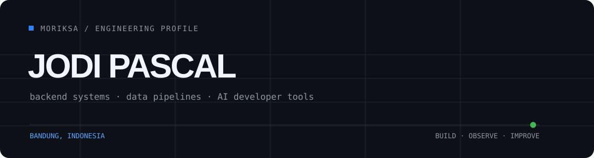

<div align="center">
  <picture>
    <source media="(prefers-color-scheme: dark)" srcset="./assets/header-dark.svg">
    <source media="(prefers-color-scheme: light)" srcset="./assets/header-light.svg">
    
  </picture>
</div>

<br>

<table>
<tr>
<td width="58%" valign="top">

### Building reliable systems from Bandung.

I am **Jodi Pascal**, a developer focused on backend engineering, data pipelines, and practical AI tooling. I enjoy turning complex workflows into software that is easier to operate, inspect, and improve.

Currently exploring autonomous agents, developer infrastructure, and production-minded Python and TypeScript systems.

<a href="https://www.linkedin.com/in/jodi-pascal-167959302/"></a>
<a href="https://github.com/MoRiksa?tab=repositories"></a>

</td>
<td width="42%" valign="top">

```yaml
name: Jodi Pascal
location: Bandung, Indonesia
focus:
  - Backend systems
  - Data pipelines
  - AI developer tools
principles:
  - Make it observable
  - Keep it maintainable
  - Ship with intent
```

</td>
</tr>
</table>

## Selected Work

<table>
<tr>
<td width="50%" valign="top">

### [Archify](https://github.com/MoRiksa/archify)

An agent skill that turns plain-language system descriptions into polished architecture, workflow, sequence, data-flow, and lifecycle diagrams.

`JavaScript` `SVG` `Agent Tooling`

[Live project](https://tt-a1i.github.io/archify/) · [Source](https://github.com/MoRiksa/archify)

</td>
<td width="50%" valign="top">

### [Backend Data Pipeline](https://github.com/MoRiksa/backend-data-pipeline-assessment)

A containerized three-service pipeline that ingests paginated data from Flask into PostgreSQL through a FastAPI service.

`Python` `FastAPI` `PostgreSQL` `Docker`

[Architecture and source](https://github.com/MoRiksa/backend-data-pipeline-assessment)

</td>
</tr>
<tr>
<td width="50%" valign="top">

### [Meridian](https://github.com/MoRiksa/meridian)

An autonomous liquidity-management agent with screening, position management, structured decision logs, and operational controls.

`JavaScript` `LLM Agents` `Solana`

[Source](https://github.com/MoRiksa/meridian)

</td>
<td width="50%" valign="top">

### [Expo One](https://github.com/MoRiksa/Expo-One)

A cross-platform mobile application built with Expo and file-based routing as part of an Android development course.

`TypeScript` `React Native` `Expo`

[Source](https://github.com/MoRiksa/Expo-One)

</td>
</tr>
</table>

## Working Stack

<div align="center">


</div>

## Engineering Notes

```text
01  Start with the problem, not the framework.
02  Prefer explicit systems over hidden magic.
03  Treat observability and documentation as product features.
04  Automate repetition; keep judgment with people.
```

## Contribution Map

<div align="center">
  <picture>
    <source media="(prefers-color-scheme: dark)" srcset="https://raw.githubusercontent.com/MoRiksa/MoRiksa/gh-pages/github-contribution-grid-snake-dark.svg">
    <source media="(prefers-color-scheme: light)" srcset="https://raw.githubusercontent.com/MoRiksa/MoRiksa/gh-pages/github-contribution-grid-snake.svg">
    
  </picture>
</div>

<div align="center">
  <sub>Open to backend engineering opportunities and thoughtful technical collaborations.</sub>
</div>
